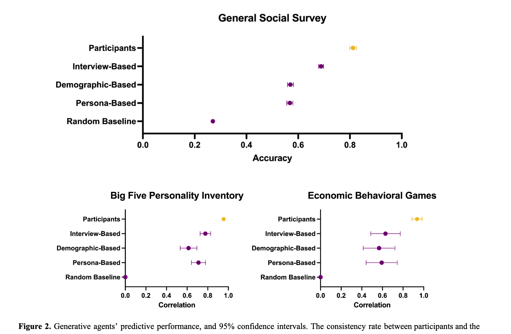
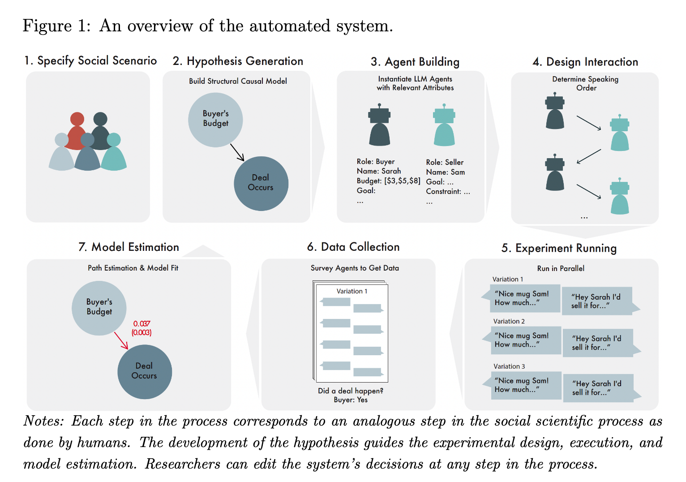

<!-- _class: lead -->

# A Data Flow Perspective on "AI Social Simulation"

**Will Recent AI Advances Enable New Social Science, Destroy Ecosystems for Knowledge, or Something More Subdued?**

---

## Follow Along Front Matter

Find a text file with a bunch of links at nickmvincent.com/static/csss-talk.txt

PDF, MD, Semantic Scholar link w/ mentioned papers,

---

<!-- _class: lead -->

## Outline

**Total Time: ~45 minutes**

1. Introduction & Key Arguments (5 min)
2. AI's Data Dependence & Background Work (10 min)
3. Problems with Current LLM Social Sim (10 min)
4. A Framework for Better Simulation (10 min)
5. (An attempt at) Summarizing (5 min)
6. Discussion! (15-20 mins?)

---

## Three Key Goals of this talk (1/3)

**Goal #1 - Share A Prediction:**
The overall impact of AI/LLM Social Simulation will fall somewhere between several extremes.

---

- Not a golden age of social scientific discovery
  - and NOT the complete automation of social science practice, though certainly some economic disruption to research labor
- Not complete destruction of epistemic communities
  - though certainly some shocks to both volunteer and semi-professional knowledge curation
- Something more subdued; in the middle!

(And I am hopeful we can impact this.)

---

## Three Key Goals of this talk (2/3)

**Goal #2 - Make A Policy Argument:**
Social science should advocate for LLM training data transparency on **purely epistemic grounds**

LLMs, if made more transparent re: the sources of human input, are well suited to support social science and especially simulation.

---

Improve transparency at three pipeline points:
- Dataset selection
- Mechanistic interpretability
- AI auditing

Dataset selection especially important for social science. Which people contributed???

---

There's lots of other reasons to wade into AI transparency and governance discussions. 

Another important one to me: I think that data transparency combined with data agency is crucial to avoid power concentration by organizations that build and/or capture powerful AI (systems with most access to information + compute).

---

**Three concrete paths to achieve LLM training data transparency:**
- Convince all our friends at tech companies that this matters!
- Convince regulators (see e.g. California, Utah)
- Convince bodies interested in transparency (public bodies) to build and deploy models
  - See e.g. Apertus, recent Swiss model

---

I'm hopeful this talk (and future iterations) can get more people excited about arguing for transparency around data.

Note: scientific/scholarly communities are themselves likely to be high-leverage groups for bargaining with tech companies (our papers provide "high quality tokens", universities train future tech employees, lots of back-and-forth between academia and industry).

---

## Three Key Goals of this talk (3/3)

Talk about some early work from my group on how we might bring "old school" philosophy of science to bear on modern LLM social simulation (which spans HCI, ML, org and biz, econ, and more)

---

## Wait, what is AI Social Simulation?

From HCI / Social Computing:

Park et al 2023 - "Generative Agents: Interactive Simulacra of Human Behavior" ([arxiv](https://arxiv.org/abs/2304.03442))

"computational software agents that simulate believable human behavior"

---

---

## Simulating Real People

Park et al 2024 - "Generative Agent Simulations of 1,000 People" ([arxiv](https://arxiv.org/abs/2411.10109))

"The promise of human behavioral simulation--general-purpose computational agents that replicate human behavior across domains--could enable broad applications in policymaking and social science."

---

---

From management / organization social science perspective:

Manning et al 2024 - "Automated Social Science: Language Models as Scientist and Subjects" ([arxiv](https://arxiv.org/abs/2404.11794))

"When given its proposed structural causal model for each scenario, the LLM is good at predicting the signs of estimated effects, but it cannot reliably predict the magnitudes of those estimates"

---

---

## AI's Fundamental Difference from Other Technologies (including methods innovations)

Current AI products are massively **data-dependent**

This makes them different from other technological advances:
- True collective dependence -- there are very many people who made contributions (though individually, each contribution, is small)
- Many counterfactuals where behavior changes make AI worse

---

## Quick Primer: How Content Becomes Model Behavior

**The training pipeline:**
1. Data collection: Your Wikipedia edit, arXiv paper, tweet, Bluesky post gets scraped
2. Dataset curation: Included in training corpus (e.g., Common Crawl, The Pile)
3. Training: Text used to update model weights via gradient descent
4. Inference: Model weights shape how LLM responds to prompts

See Gao et al. 2020

---

## Key insight of content -> model behaviour

Individual contributions are small, but:
- They collectively determine what the model "knows"
- Specific domains/communities can have outsized influence
- But we can't trace backward from outputs to data sources

---

---

## Thought Experiments

Imagine worlds without:
- Wikipedia
- People using thumbs up in ChatGPT
- People posting on Facebook

---

**All the human activity that happens here, and gets captured as digital records, matters for AI systems**

(Impact does require either organization of very impactful contributors, e.g. get all the experts in one area, or *very large action*, e.g. >10% of all non-lurking Internet users)

---

## Related Work: Jailbreaks Study

"An Audit and Analysis of LLM-Assisted Health Misinformation Jailbreaks Against LLMs" ([link](https://arxiv.org/abs/2508.10010)) - upcoming at AIES next month
- with Ayana Hussain, Patrick Zhao

LLMs can be very good at:
- Generating jailbreaks that get other LLMs to produce misinformation
- Detecting LLM-produced misinformation
- Though, actual outputs differ from "real" misinformation (e.g. Reddit posts)

How can this all be true at once? Prompting models to sample from different parts of the distribution

---

## There is strong reason to believe the LLM paradigm is useful for social knowledge

Can an LLM placed into some kind of social/economic simulation might tell us something "real" about how real people might respond? Can we capture real knowledge that is similar in character to the regression coefficient in a very good quantitative study that tells us something about human behavior?

I think it *is* possible that a model responds a certain way because of collective behaviour ensconced in data records and now model weights.

---

(In some sense, there is a vision of social science in which we first just collect as many records as possible, filter them, feed them into a giant pile, and then try to use dataset documentation, data attribution, mechanistic interpretability, auditing to reverse engineer econometric models and causality)

---

## My Research Agenda

Three interconnected areas exploring data dependence:

1. **Data Leverage & Collective Bargaining**
2. **Public AI**
3. **Content Ecosystems**

---

## Data Leverage

AI depends on data, so we can threaten to withhold, modify, or redirect

Enables data creators to negotiate:
- Small groups with high-leverage specialist data
- Large groups of general users

**Recent work:** CBI position paper @ NeurIPS ([link](https://arxiv.org/abs/2506.10272))
**Older work:** Data leverage ([framework paper](https://arxiv.org/abs/2012.09995), [experiments](https://dl.acm.org/doi/10.1145/3449177), [more experiments](https://dl.acm.org/doi/10.1145/3308558.3313742))

---

## The CBI / Data Leverage Pitch:

We (computing, computational social science) should support collective action around data so communities can wield "data leverage"

**Note:** Data leverage can be broadly applied to many causes, including those I don't personally agree with

Technical aspects of the work involve data poisoning, scaling, attribution, etc. (If certain groups have lots of leverage to impact a certain model, they probably have high "influence" on that model -- matters for social interpretation of any simulations!)

---

## Data Leverage & Collective Bargaining for Information

**Personal interest area:** Collective bargaining for information to:
- Cushion economic shocks from automation of knowledge work
- Prevent concentration of power by winners in the AI Race

---

## Data Leverage and Bluesky / AT Proto (new blogging, source control, etc.)

**Connection to Bluesky:** Keen to connect on Data Leverage-y topics in the context of Bluesky - great discussion at FAccT this year about atproto and these topics

---

## Public AI

We could support public bodies that build/deploy AI

Disadvantages to be sure ("governments can never compete with Big Tech!"), but also benefits:
- More likely to deploy transparent/open models
- Governed by public in at least some sense (national AI institutes, universities)
- Consortium approach is powerful for AI (certain aspects are natural public goods)

**See:** publicai.network, publicai.co, https://arxiv.org/abs/2507.09296

---

## Content Ecosystem Concerns

**The hypothesis:**
1. AI substitutes for Wikipedia/Stack Overflow/etc.
2. People stop visiting these platforms
3. Volunteer energy "dries up"
4. New AI models get worse (Wikipedia not updated)
5. Feedback loop wipes out communities

**Shout out:** CDSC work on ecology of online communities (Mako, Nate, Jeremy, Aaron, Sohyeon, and maybe current students I'll chat with after!)

See also Tipping Points for Content Ecosystems ([link](https://dataleverage.substack.com/p/tipping-points-for-content-ecosystems))

---

And:

- Rio-Chanona, Maria del, Nadzeya Laurentsyeva and Johannes Wachs. “Large language models reduce public knowledge sharing on online Q&A platforms.” PNAS Nexus 3 (2023): n. pag.

- Burtch, Gordon, Dokyun Lee and Zhichen Chen. “The consequences of generative AI for online knowledge communities.” Scientific Reports 14 (2024): n. pag.

- Wagner, Christian and Ling Jiang. “Death by AI: Will large language models diminish Wikipedia?” Journal of the Association for Information Science and Technology 76 (2025): 743 - 751.

---

**Related work:**
- Empirical and simulation work studying specific instances of collective action
- How much can group X impact AI model Y in terms of performance metric Z?
- Whole workshop at NeurIPS this year on this: https://acaworkshop.github.io/ (program coming soon!)

See e.g.: Karan et al. 2025 ([link](https://dl.acm.org/citation.cfm?id=3732098))

---

## The Promise and Problem of LLM Social Simulation

Why it could be very good:
- Lots of true causal knowledge about social interaction embedded in weights
- Drawing on massive amounts of real human data

---

**The fundamental problem:**
- Can't trace the mechanism of that human data
- Which domains had biggest influence on weights?
- Which subcommunities shaped the model?
- **All are "???" right now**

---

Ok, so we could just stop here, and say. Well if we knew *more* about the training data selection and weighting, we could do better in some sense. But that doesn't actually help us deal with the some of the more foundational challenges with using simulation for various research goals.

---

<!-- _class: lead -->

## Part 2: Problems with LLM Social Simulation

---

## Problem 1: Stuck Proving "Can" Not "How"

Current state: most work proves LLMs *can* produce phenomena

**Not:** studying how behavior is produced or how it changes with interventions

Many papers ask: "Can LLM agent simulation produce this behavior?"
Instead of: "How does this behavior arise and change?"

---

## Believability != Understanding

Larooij et al. survey ([link](https://arxiv.org/abs/2504.03274) found:
- Most metrics focus on "believability" as evaluation
- Human or LLM as judge

---

In simulation literature: **"dynamical sufficiency"** = how well simulation captures dynamics of target phenomenon

Consider: accurately plotting a curve without necessarily understanding the underlying mechanism

LLMs seemed to move us up the dynamical sufficiency scale (larger action space)

---

## Problem 2: Phenomenal vs. Mechanistic Models

**To know "how" a phenomenon arises:**
Mechanists argue we must map model components and activities to hypothesized "real" components

**Phenomenal model:** only concerned with whether behavior is produced accurately

---

## The Intervention Problem

For practical social simulation, we want to test interventions in **unknown counterfactual scenarios**

**The gap:**
- Papers evaluate using sufficiency/believability
- Then test interventions *as if* there are plausible mechanisms

This is related to mechanisms, not just dynamical sufficiency

---

## Problem 3: Can We Use Closed Models?

**Question for the community:**
Can we do LLM sim with closed models accessed by API?

WIP: 35 out of 35 surveyed papers used an API

---

## Threats to Reproducibility

API-based models introduce instability:
- Safety guardrails could alter agent behavior mid-experiment
- Version updates between runs
- Hidden prompt injections
- Safety filters
- Which people contributed?!

**The problem is solvable with offline models**
(But... GPU/technical constraints)

---

## The Determinism Problem

Even technical approaches (checking if distributions match) remain "phenomenal"

Mechanisms can be stochastic, but if deterministic:
**LLMs may not be deterministic in practice** even with same seed/temperature

- See e.g. very recent "Thinking Machines" work

---

## Defeating Non-Determinism

Work exists on "defeating non-determinism":
- Everything must happen on the same GPU
- Cannot be split up across GPUs
- Then outputs become deterministic

**For API access:** This is not possible
Large providers almost certainly split operations across multiple GPUs

---

<!-- _class: lead -->

## Part 3: A Framework for Better Simulation

---

## Motivation

**Simulation epistemology is confusing**
- Shared pain point across many projects
- Too much historical work on modeling to catch up on

**Goal:** Reduce overhead of needing domain knowledge from philosophy of science

---

(In the spirt of this seminar, it seems we really need people chatting across departments, our CS grad students to get course credit for going to take an STS course...)

---

## The STIE Scale

A scale/axis for measuring **"mechanism plausibility"**

Increases as more parts of the model are falsifiable

To be falsifiable, must have a claim/hypothesis put forward

---

## STIE: Level 0 - S (Simulation)

**Level 0:**
You have a simulation **S** with no operationalized target

Simulation: A set of procedures. Pragmatically, a computer simulation contains the agents, code, architectures, data pipelines,and update rules that generate outputs

Note: the “overall goal” of why you created the model is different from a target’s operationalization.

Examples of level 0:
- Quickstart simulation in your favorite ABM library
- Conway’s game of life
- LLM evals: simulations unconcerned with accurately modeling an overall system, but maybe its environment is used to evaluate how LLMs act in it

---

## STIE: Level 1 - T (Target)

**Level 1:**
Target phenomenon **T** needs to be operationalized to be falsifiable

A target/phenomenon is the system a modeler is trying to represent.

Examples of level 1:
Simulations that produce the operationalized output of the target phenomenon, but with no claims about the “how”

---

## STIE: Level 2 - I (Intent)

**Level 2:**
**Intent** - Mapping of what mechanisms the components/organization in the simulation represent

The intent contains the scope of the simulation (what it’s should be used for, and importantly, what it should not) and the mapping (what parts of the simulation correspond to what parts of *T* or its hypothesized mechanisms)

Examples:
- Schelling’s segregation model puts forward a hypothesis of how inadvertent but small preferences may lead to segregation.

---

## STIE: Level 3 - E (Evidence)

**Level 3:**
**Evidence** supports how S, T, I are chosen and operationalized

Can also be falsified/countered

---

## Using the STIE Framework

Each level is a prerequisite for the next

Higher level not strictly better. But!

By evaluating your sim using this framework:
- Easier way to think about background epistemology
- Clarifies epistemic contributions at different levels

## Connecting the Dots

Final thoughts on connecting the dots

---

<!-- _class: lead -->
